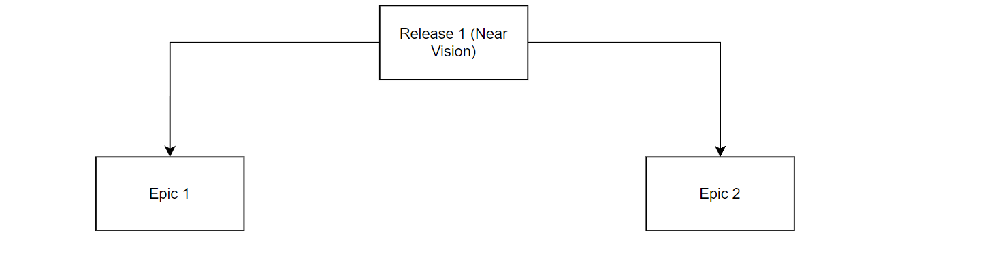
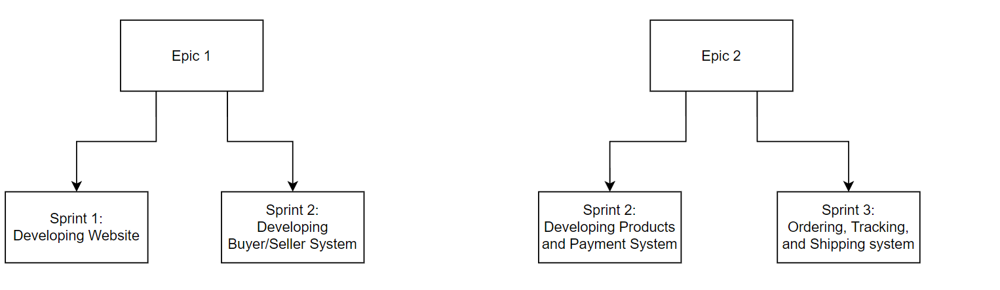
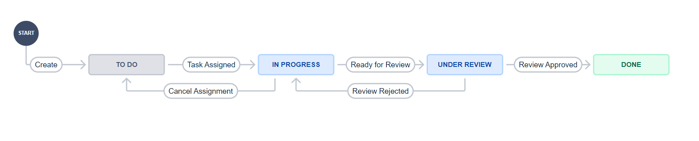

# Deal Zone, An Agile Project. 
**CSE 325 Lab Examination** -  By:  *Ahmed Fawzy Amer - 17P6035* 
--- 

---

## **Scrum Team:** 

Our scrum team of for this project consists of 7 members divided as:

**1x Product Owner**, Mr. P: A representative of the stakeholders of “Deal Zone” – Full Time Role.

**1x Scrum Master**, Mr. S: The facilitator of the process to ensure the flow of process.

**5x Development Team**: T-shaped and long-lived team that have been working together for 7 years. The discipline of each member will be variable during the sprints since we are all T-shaped and can do each other’s work. 

Members are:

1. Mr AB: Senior Agile Developer, T-Shaped. **MOST effcient** as front-end BUT can fill other roles

2. Mr XY: Senior Agile Developer, T-Shaped. **MOST effcient** as tester BUT can fill other roles

3. Mr ZZ: Senior Agile Developer, T-Shaped. **MOST effcient** as integrator BUT can fill other roles

4. Mr AY: Senior Agile Developer, T-Shaped. **MOST effcient** as back-end BUT can fill other roles

5. Mr IO: Senior Agile Developer, T-Shaped. **MOST effcient** as back-end BUT can fill other roles

---

## Stakeholders

The main shareholders and board directors are the family of Y, in which they own 60% of the project shares, while the 40% left are for investors in stock. Shareholders of Y consist of -mainly- of Mr. A, the CEO of the project. Our product owner (Mr. P) will be in direct communication with him to ensure that the ideas and strategies of the client (Mr. A) are well understood and met by the agile team. There are other minor stakeholders that will be also joining the discussion about this product with the product owner and their takes will be also taken into consideration.

---

## Stakeholders Goal

> Our goal in this project is to establish an e-commerce website that can have the potential to challenge the competitors such as Amazon and Jumia. We plan to start only in Cairo and Giza, but we have the plan and the vision to expand to The whole Arab republic of Egypt as well as the gulf countries. Our motto  is simple: Quality products, fast delivery, happy customer. 
 
 ---

## Near Vision

The near vision of this product is to establish a live and working platform that can support the demand of users of Cairo and Giza, starting with a simple shipping tracking system. This vision includes only a website and not the applications.

**Our Near vision** is planned to be achieve within Release 1. Release 1 is composed of 2 Epics as shown:

the aggregation of Epic 1 and Epic 2, will be our starting point.

After the release is completed, we plan to start expanding by (incrementally, thanks to Agile) until we achieve our Far vision.

---

## Far Vision

The far vision of this product is to evolve our system to support the entire republic of Egypt, supporting millions of users, expanding to the gulf countries, adding all possible categories of products and have a large share of the e-commerce in Egypt and the middle east by having a complex yet rapid order packaging and delivery system that reduces the time between order placement and order delivery. In addition, having a responsive and average-user-friendly application for ease of ordering. 

---

## Estimating story points per sprint
As indicated and supported from part 1, our team on average executed 15 story point per sprint. Stories are ranging from 1 to 3 story points. It’s worth noting that the numbers (1, 3) are relative numbers to our team and not a universal scale. We have found that 1 story point, for our 7-members long-lived team, achieves an average-sized story, while a 3 story points for the longer and more complicated stories. At some point we may need a 5, or even a 7, story point per story depending on the story size but we haven’t met this case yet in out near vision of the project. But, for the current project, the sizes of the stories are relatively close and hence we are sticking to the numbers 1 and 3. More clarification on why exactly we are choosing 1, 3, 5, 7 sequence shortly.

---

## Workflow rules

TO DO: Work of the sprint is waiting to be assigned and started by the assignee.

    Task Assigned: Task has been assigned and work has been started

In Progress: Work is under Development

	Ready for Review: Work has been completed and waiting for approval/rejection
	Cancel Assignment: Work needs to be reassigned to someone else due to internal reasons.
Under Review: Code reviewer reviews the completed work and decides whether the work is satisfactory and meets requirements or not.

	Review Approved: Work has been accepted and the story has been completed.
	Review Rejected: Work has been rejected and the story needs to be modified or reworked.
Done: The Story is completed.

---
